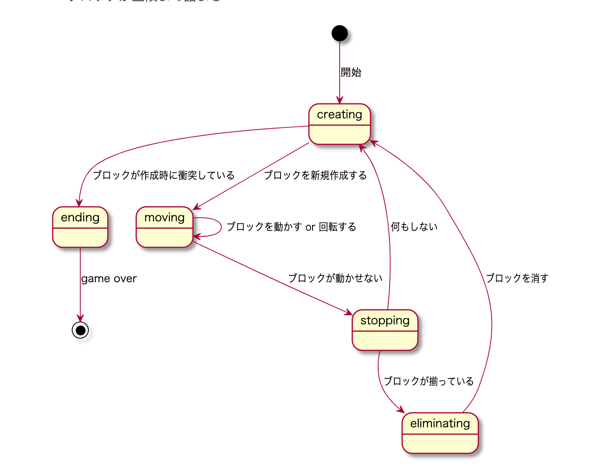

## Tetris written by Typescript

URL: https://ts-tetris.netlify.com

### Web UI


### Terminal


### プレイ方法

```shell
npm install
npm run play:console  # console
npm run play:web      # web
```

### 技術スタックなど

- Typescript: 3.7.4
- Node: v13.5.0
- Vue.js: 2.6.11

### 盤面の構造
```
縦20行 × 横10列

↓イメージこんな感じ
＊・・・・・・・・・・＊
＊・・・・・・・・・・＊
＊・・・・・・・・・・＊
＊・・・・・・・・・・＊
＊・・・・・・・・・・＊
＊・・・・・・・・・・＊
＊・・・・・・・・・・＊
＊・・・・・・・・・・＊
＊・・・・・・・・・・＊
＊・・・・・・・・・・＊
＊・・・・・・・１・・＊
＊・・・・・・・Ｘ１・＊
＊・・・・・・・・１・＊
＊・・・・・・・・・・＊
＊・・・・・・・・・・＊
＊・・・・・・・・・・＊
＊・・・・・・・・・・＊
＊・・・・・・・０・・＊
＊・・・０００００・・＊
＊・００００・００・・＊
＊＊＊＊＊＊＊＊＊＊＊＊
```

- `＊`：壁衝突判定用ブロック（横は 12 列、縦 21 列になる）
- `０`：固定化されているブロック
- `１`：動かしているブロック


## 盤面の状態
盤面のステートマシンを作る

- moving
    - ブロックを移動できる
- creating
    - 新しいブロックを作る
- stopping
    - ブロックを止める
- eliminating
    - ブロックを消去する
- ending
    - ブロックが上段まで詰まる

```{plantuml}
[*] --> creating: 開始
creating --> moving: ブロックを新規作成する
moving --> moving: ブロックを動かす or 回転する
moving --> stopping: ブロックが動かせない
stopping --> eliminating: ブロックが揃っている
eliminating --> creating: ブロックを消す
stopping --> creating: 何もしない
creating --> ending: ブロックが作成時に衝突している
ending --> [*]: game over
```


